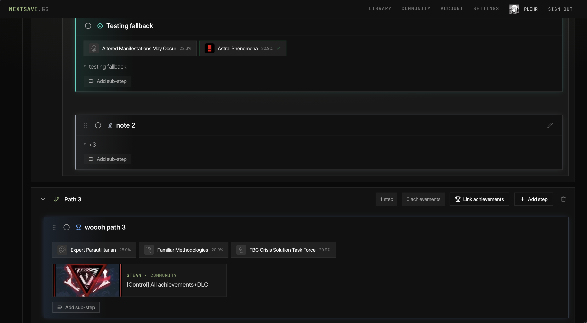
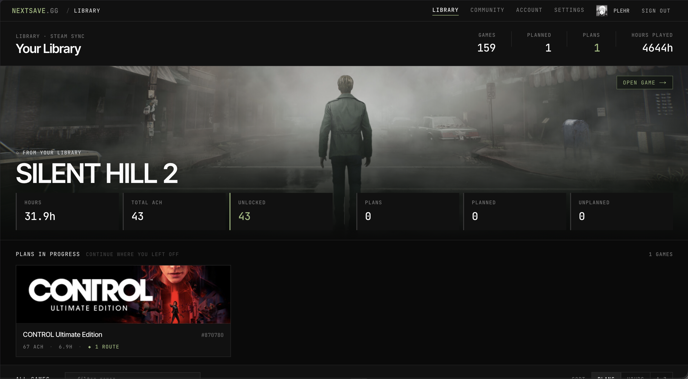
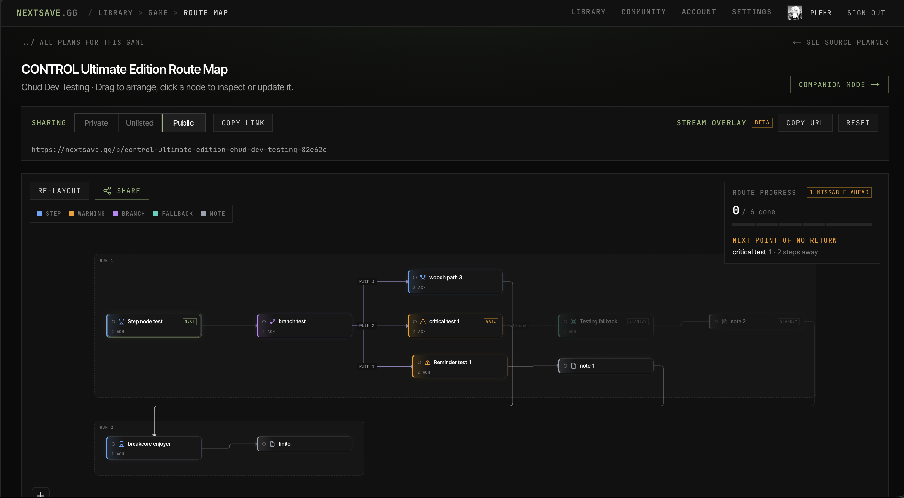

# NextSave

A full-stack web app for Steam players to visually plan, route, and track
achievement completion across their entire game library.

**🔗 Live:** [nextsave.gg](https://nextsave.gg)

> **Note:** The source for NextSave is private. This repo is a showcase of the
> product and how it's built. I'm happy to walk through the architecture, the
> tradeoffs, or any part of the codebase in an interview.

---

## What it is

Completionists juggle dozens of games, each with sprawling achievement lists,
hidden dependencies, and missable unlocks. NextSave turns that mess into
something you can actually plan: a visual route planner that lets you map out
how to get to 100%, in what order, across your whole library.

<!-- Lead with your strongest visual. The node-graph planner is the money shot. -->

## Features

- **Node-based route planner** — map achievement dependencies as a visual graph
  and lay out the most efficient path to completion.
- **Library-wide tracking** — pull in your full Steam library and track progress
  across every game in one place.
- **Companion mode** — <!-- one line on what companion mode does, in your words -->
- **Exportable plans** — export your completion route to follow along as you play.
- **Real-time Steam data** — game and achievement data synced live via the
  Steam Web API.

<!-- Optional: a second screenshot showing the library/tracking view -->

## How it's built

| Layer       | Stack                                          |
|-------------|------------------------------------------------|
| Frontend    | Next.js, TypeScript                            |
| Backend     | Fastify REST API, Prisma ORM                   |
| Database    | PostgreSQL                                     |
| Integration | Steam Web API                                  |
| Deployment  | VPS with managed PostgreSQL                    |

A few things I cared about while building it:

- **A clean REST API surface** — the Fastify + Prisma backend is structured so
  game/achievement data, user libraries, and saved routes are clearly separated
  and easy to reason about.
- **A genuinely usable graph UI** — the route planner had to stay responsive and
  legible even for games with large, tangled achievement sets.
- **Resilient Steam integration** — syncing against a third-party API means
  handling rate limits, missing data, and stale entries gracefully.

## Why I built it

I wanted to use real users to validate the idea before writing a line of code,
so I floated the concept on r/steamachievements first — it landed 60+ positive
community responses, which is what convinced me to build it for real.

## Contact

- [LinkedIn](https://www.linkedin.com/in/trisslazaj/)
- [Email](mailto:triss.lazaj@gmail.com)
